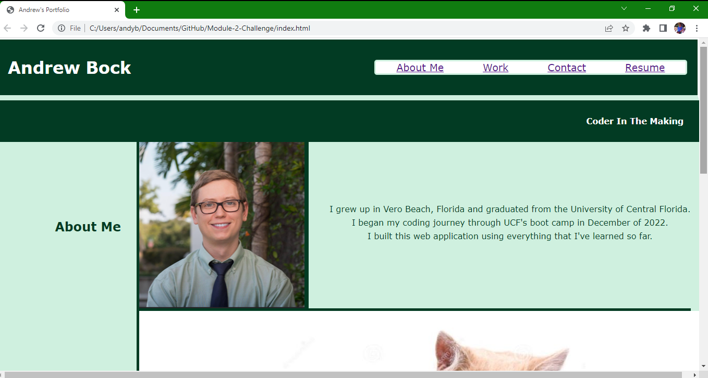
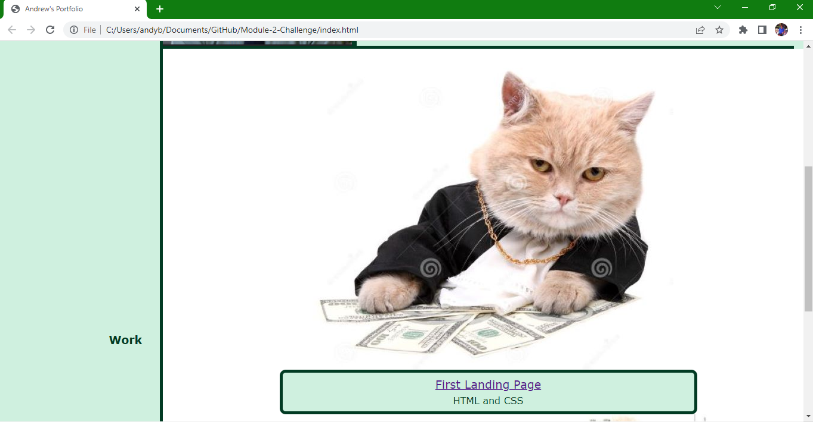
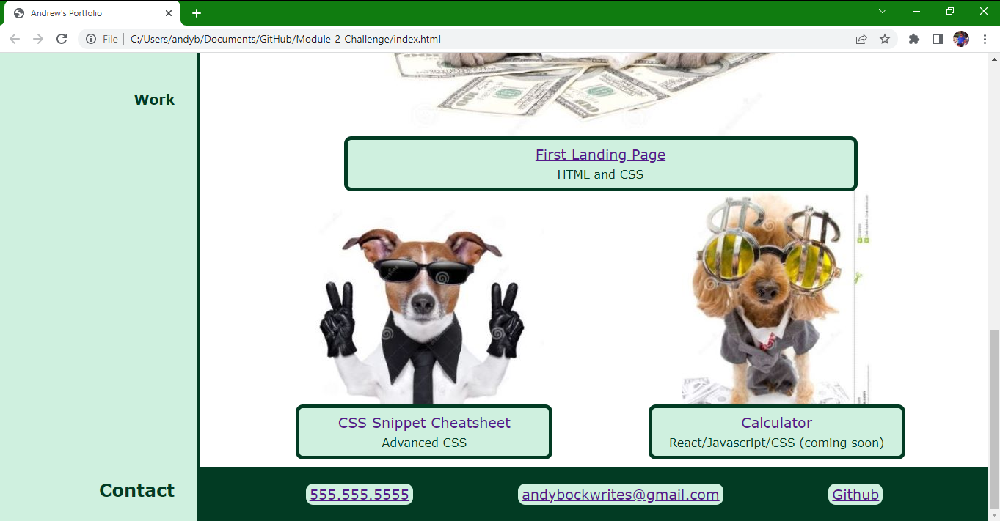

# Andrew's Porfolio: Advanced CSS

## Description

For the Second Module Challenge in my coding boot camp, I was tasked with building a portfolio, so that potential employers can easily reiew and assess my deployed work.

The Acceptance Criteria is as follows:

GIVEN I need to sample a potential employee's previous work
WHEN I load their portfolio
THEN I am presented with the developer's name, a recent photo or avatar, and links to sections about them, their work, and how to contact them
WHEN I click one of the links in the navigation
THEN the UI scrolls to the corresponding section
WHEN I click on the link to the section about their work
THEN the UI scrolls to a section with titled images of the developer's applications
WHEN I am presented with the developer's first application
THEN that application's image should be larger in size than the others
WHEN I click on the images of the applications
THEN I am taken to that deployed application
WHEN I resize the page or view the site on various screens and devices
THEN I am presented with a responsive layout that adapts to my viewport

## Installation

N/A

## Screenshot

## Credits

No source code used.

## License

N/A